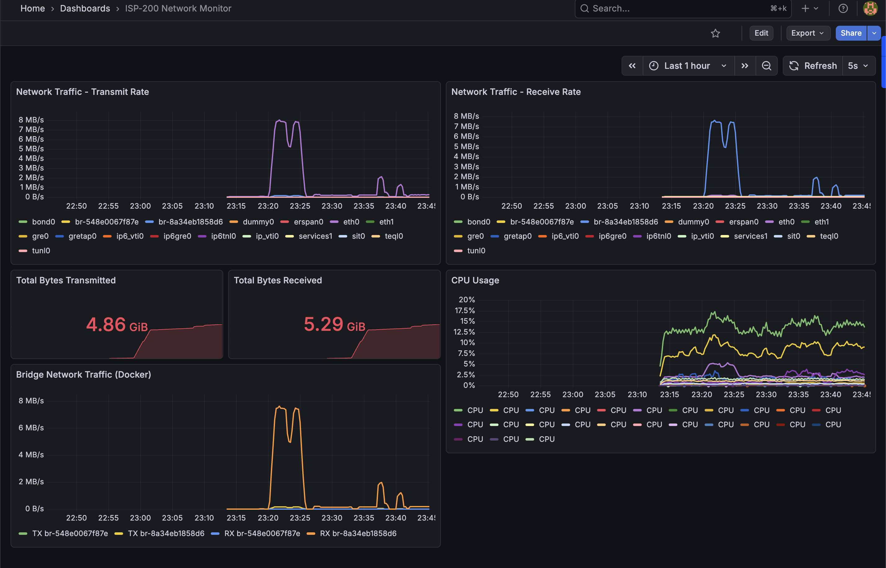
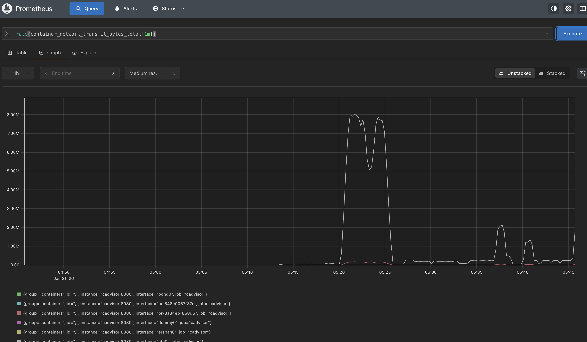
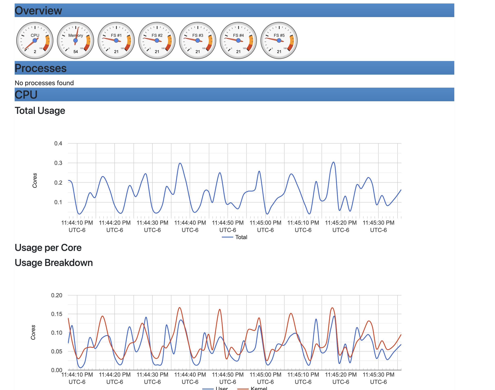

# ISP-200 Residencial

## Laboratorio de Simulación de ISP para 200 Usuarios Residenciales

Este laboratorio simula la infraestructura completa de un **Proveedor de Servicios de Internet (ISP) pequeño** diseñado para atender aproximadamente **200 usuarios residenciales** con un único **POP (Point of Presence)**.



---

## Tabla de Contenidos

- [Características](#características)
- [Arquitectura de Red](#arquitectura-de-red)
- [Requisitos](#requisitos)
- [Inicio Rápido](#inicio-rápido)
- [Componentes del Laboratorio](#componentes-del-laboratorio)
- [Protocolos de Routing](#protocolos-de-routing)
- [Stack de Monitoreo](#stack-de-monitoreo)
- [Comandos Útiles](#comandos-útiles)
- [Estructura del Proyecto](#estructura-del-proyecto)
- [Documentación Adicional](#documentación-adicional)

---

## Características

- **Simulación realista** de un ISP pequeño con arquitectura de 5 capas
- **BGP** con upstream provider (AS 65000 ↔ AS 65100)
- **OSPF** como IGP interno con múltiples áreas
- **CGNAT** implementado con nftables (RFC 6598)
- **6 CPEs** simulando la base de usuarios (~33 usuarios cada uno)
- **Monitoreo completo** con Prometheus + Grafana + cAdvisor
- **Generador de tráfico** para visualizar métricas en tiempo real
- **17+ contenedores** corriendo simultáneamente
- **100% compatible** con macOS ARM64 (Apple Silicon)

---

## Arquitectura de Red

```
                              ┌─────────────────────────────────────┐
                              │           INTERNET                  │
                              │         (Simulado)                  │
                              └─────────────────┬───────────────────┘
                                                │
                                                │ BGP eBGP
                                                │ AS 65000
                                                ▼
                              ┌─────────────────────────────────────┐
                              │         UPSTREAM-SIM                │
                              │        192.168.200.1                │
                              │     Simula Transit Provider         │
                              └─────────────────┬───────────────────┘
                                                │
                                                │ eBGP Peering
                                                ▼
┌─────────────────────────────────────────────────────────────────────────────────┐
│                              ISP-200 (AS 65100)                                 │
│                                                                                 │
│  ┌───────────────────────────────────────────────────────────────────────────┐ │
│  │                           CAPA DE BORDE                                   │ │
│  │                                                                           │ │
│  │                         ┌─────────────────┐                               │ │
│  │                         │   EDGE-ROUTER   │                               │ │
│  │                         │  192.168.200.2  │                               │ │
│  │                         │   BGP + OSPF    │                               │ │
│  │                         └────────┬────────┘                               │ │
│  └──────────────────────────────────┼────────────────────────────────────────┘ │
│                                     │ OSPF Area 0                              │
│  ┌──────────────────────────────────┼────────────────────────────────────────┐ │
│  │                           CAPA CORE                                       │ │
│  │                                  │                                        │ │
│  │           ┌──────────────────────┼──────────────────────┐                 │ │
│  │           │                      │                      │                 │ │
│  │    ┌──────┴──────┐        ┌──────┴──────┐               │                 │ │
│  │    │ CORE-ROUTER │        │ CGNAT-ROUTER│               │                 │ │
│  │    │ .200.3      │        │ .200.4      │               │                 │ │
│  │    │ OSPF Hub    │        │ NAT 444     │               │                 │ │
│  │    └──────┬──────┘        └─────────────┘               │                 │ │
│  └───────────┼─────────────────────────────────────────────┘                 │
│              │                                                                │
│  ┌───────────┼───────────────────────────────────────────────────────────────┐│
│  │           │              CAPA DE AGREGACIÓN                               ││
│  │    ┌──────┴──────────────────┐                                            ││
│  │    │                         │                                            ││
│  │  ┌─┴───────────┐      ┌──────┴──────┐                                     ││
│  │  │   AGG-1     │      │   AGG-2     │                                     ││
│  │  │  .200.10    │      │  .200.11    │                                     ││
│  │  │ Zona Norte  │      │ Zona Sur    │                                     ││
│  │  │ ~140 users  │      │ ~60 users   │                                     ││
│  │  └──────┬──────┘      └──────┬──────┘                                     ││
│  └─────────┼────────────────────┼────────────────────────────────────────────┘│
│            │                    │                                             │
│  ┌─────────┼────────────────────┼────────────────────────────────────────────┐│
│  │         │     CAPA DE ACCESO │                                            ││
│  │    ┌────┴────┐          ┌────┴────┐                                       ││
│  │    │         │          │         │                                       ││
│  │ ┌──┴───┐ ┌───┴──┐    ┌──┴───┐                                             ││
│  │ │ACC-1 │ │ACC-2 │    │ACC-3 │                                             ││
│  │ │.20   │ │.21   │    │.22   │                                             ││
│  │ └──┬───┘ └──┬───┘    └──┬───┘                                             ││
│  └────┼────────┼───────────┼─────────────────────────────────────────────────┘│
│       │        │           │                                                  │
│  ┌────┼────────┼───────────┼─────────────────────────────────────────────────┐│
│  │    │  CLIENTES (CPE)    │                                                 ││
│  │    │        │           │                                                 ││
│  │ ┌──┴──┐ ┌───┴──┐ ┌──────┴──────┐                                          ││
│  │ │CPE-1│ │CPE-2 │ │CPE-3  CPE-4 │  CPE-5  CPE-6                            ││
│  │ │.10  │ │.20   │ │.30    .40   │  .50    .60                              ││
│  │ └─────┘ └──────┘ └─────────────┘                                          ││
│  │  (Cada CPE representa ~33 usuarios residenciales)                         ││
│  └───────────────────────────────────────────────────────────────────────────┘│
└───────────────────────────────────────────────────────────────────────────────┘

                         SERVICIOS DE INFRAESTRUCTURA
        ┌─────────────┐  ┌─────────────┐  ┌─────────────┐  ┌─────────────┐
        │ Prometheus  │  │  Grafana    │  │  cAdvisor   │  │Traffic Gen  │
        │ .200.100    │  │  .200.101   │  │  .200.102   │  │  .200.200   │
        │ :9090       │  │  :3000      │  │  :9080      │  │             │
        └─────────────┘  └─────────────┘  └─────────────┘  └─────────────┘
```

---

## Requisitos

| Recurso | Mínimo | Recomendado |
|---------|--------|-------------|
| CPU | 2 cores | 4+ cores |
| RAM | 4 GB | 8+ GB |
| Disco | 5 GB | 10 GB |
| Docker | 20.10+ | Latest |

**Plataformas soportadas:**
- macOS ARM64 (Apple Silicon M1/M2/M3/M4)
- macOS Intel
- Linux AMD64/ARM64

**Software requerido:**
- Docker Desktop o OrbStack (recomendado para macOS)
- Docker Compose v2+

---

## Inicio Rápido

### 1. Clonar/Navegar al directorio

```bash
cd /path/to/container-labs-project/labs/isp-200-residencial
```

### 2. Levantar el laboratorio

```bash
docker compose up -d
```

### 3. Verificar estado

```bash
docker compose ps
```

Deberías ver 17 contenedores en estado "running".

### 4. Acceder a servicios

| Servicio | URL | Credenciales |
|----------|-----|--------------|
| Grafana | http://localhost:3000 | admin / admin123 |
| Prometheus | http://localhost:9090 | - |
| cAdvisor | http://localhost:9080 | - |

### 5. Verificar BGP

```bash
docker exec isp200-edge vtysh -c "show bgp summary"
```

Salida esperada:
```
Neighbor        V         AS   MsgRcvd   MsgSent   TblVer  InQ OutQ  Up/Down State/PfxRcd
192.168.200.1   4      65000       XXX       XXX        0    0    0 XX:XX:XX            1
```

### 6. Verificar OSPF

```bash
docker exec isp200-core vtysh -c "show ip ospf neighbor"
```

### 7. Probar conectividad end-to-end

```bash
docker exec isp200-cpe1 ping -c 3 192.168.200.1
```

---

## Componentes del Laboratorio

### Routers (FRRouting 8.4.1)

| Contenedor | Hostname | IP | Función | Protocolos |
|------------|----------|-----|---------|------------|
| isp200-upstream | upstream-sim | 192.168.200.1 | Transit Provider | BGP AS 65000 |
| isp200-edge | edge-router | 192.168.200.2 | Router de Borde | BGP AS 65100 + OSPF |
| isp200-core | core-router | 192.168.200.3 | Core/Backbone | OSPF |
| isp200-cgnat | cgnat-router | 192.168.200.4 | CGNAT | nftables |
| isp200-agg1 | agg-1 | 192.168.200.10 | Agregación Norte | OSPF |
| isp200-agg2 | agg-2 | 192.168.200.11 | Agregación Sur | OSPF |
| isp200-acc1 | acc-1 | 192.168.200.20 | Acceso Sector A | OSPF |
| isp200-acc2 | acc-2 | 192.168.200.21 | Acceso Sector B | OSPF |
| isp200-acc3 | acc-3 | 192.168.200.22 | Acceso Sector C | OSPF |

### CPEs (Clientes Simulados)

| Contenedor | IP | Usuarios Simulados |
|------------|-----|-------------------|
| isp200-cpe1 | 192.168.201.10 | ~33 |
| isp200-cpe2 | 192.168.201.20 | ~33 |
| isp200-cpe3 | 192.168.201.30 | ~33 |
| isp200-cpe4 | 192.168.201.40 | ~33 |
| isp200-cpe5 | 192.168.201.50 | ~33 |
| isp200-cpe6 | 192.168.201.60 | ~35 |

### Servicios de Infraestructura

| Contenedor | IP | Puerto | Función |
|------------|-----|--------|---------|
| isp200-prometheus | 192.168.200.100 | 9090 | Métricas y alertas |
| isp200-grafana | 192.168.200.101 | 3000 | Visualización |
| isp200-cadvisor | 192.168.200.102 | 9080 | Métricas de contenedores |
| isp200-traffic-gen | 192.168.200.200 | - | Generador de tráfico |

---

## Protocolos de Routing

### BGP (Border Gateway Protocol)

```
┌──────────────────┐                    ┌──────────────────┐
│   AS 65000       │                    │   AS 65100       │
│   (Upstream)     │◄──── eBGP ────────►│   (ISP-200)      │
│                  │                    │                  │
│ Anuncia:         │                    │ Anuncia:         │
│ - 0.0.0.0/0      │                    │ - 192.168.192/20 │
└──────────────────┘                    └──────────────────┘
```

**Configuración clave:**
- `no bgp ebgp-requires-policy` (requerido en FRR 8.x+)
- Soft-reconfiguration inbound habilitado
- Router ID basado en loopback

### OSPF (Open Shortest Path First)

| Área | Routers | Función |
|------|---------|---------|
| 0 (Backbone) | edge, core, agg-1, agg-2 | Interconexión principal |
| 1 | acc-1, acc-2 | Zona Norte |
| 2 | acc-3 | Zona Sur |

---

## Stack de Monitoreo

### Prometheus



**Queries útiles:**

```promql
# Tráfico de red transmitido
rate(container_network_transmit_bytes_total[1m])

# Uso de CPU por contenedor
rate(container_cpu_usage_seconds_total{name=~"isp200.*"}[5m])

# Memoria usada
container_memory_usage_bytes{name=~"isp200.*"}
```

### cAdvisor



Proporciona métricas detalladas de cada contenedor:
- Uso de CPU (total y por core)
- Memoria utilizada
- Tráfico de red por interfaz
- I/O de disco

### Grafana

El dashboard "ISP-200 Network Monitor" incluye:

- **Network Traffic - Transmit Rate**: Tráfico de salida en tiempo real
- **Network Traffic - Receive Rate**: Tráfico de entrada en tiempo real
- **Total Bytes Transmitted/Received**: Contadores acumulados
- **CPU Usage**: Uso de CPU por contenedor
- **Bridge Network Traffic**: Tráfico en bridges de Docker

---

## Comandos Útiles

### Gestión del Laboratorio

```bash
# Ver estado de todos los contenedores
docker compose ps

# Ver logs de un servicio
docker logs -f isp200-edge

# Reiniciar un servicio específico
docker compose restart edge-router

# Detener el laboratorio (preserva datos)
docker compose stop

# Detener y eliminar todo
docker compose down --volumes --remove-orphans
```

### Acceso a Routers FRRouting

```bash
# Edge Router (BGP + OSPF)
docker exec -it isp200-edge vtysh

# Core Router (OSPF)
docker exec -it isp200-core vtysh

# Aggregation Router
docker exec -it isp200-agg1 vtysh

# Access Router
docker exec -it isp200-acc1 vtysh
```

### Comandos FRR Importantes

```
# Tabla de rutas
show ip route
show ip route bgp
show ip route ospf

# Estado BGP
show bgp summary
show bgp ipv4 unicast
show bgp neighbors 192.168.200.1

# Estado OSPF
show ip ospf neighbor
show ip ospf interface
show ip ospf database

# Configuración actual
show running-config
```

### Pruebas de Conectividad

```bash
# Ping desde CPE hacia Internet simulado
docker exec isp200-cpe1 ping -c 3 192.168.200.1

# Traceroute completo
docker exec isp200-cpe1 traceroute -n 192.168.200.1

# Verificar ruta default en CPE
docker exec isp200-cpe1 ip route
```

### CGNAT

```bash
# Ver reglas NAT activas
docker exec isp200-cgnat nft list ruleset

# Ver conexiones NAT
docker exec isp200-cgnat cat /proc/net/nf_conntrack | head
```

---

## Estructura del Proyecto

```
labs/isp-200-residencial/
├── README.md                    # Este archivo
├── docker-compose.yml           # Definición principal del lab
├── docs/                        # Documentación detallada
│   ├── README.md               # Índice de documentación
│   ├── ARQUITECTURA.md         # Diseño de red detallado
│   ├── CONFIGURACION-TECNICA.md # Configs de FRR, BGP, OSPF
│   ├── OPERACIONES.md          # Guía de operaciones
│   └── MONITOREO.md            # Stack de monitoreo
├── configs/
│   ├── frr/                    # Configuraciones FRRouting
│   │   ├── upstream-sim/       # BGP AS 65000
│   │   ├── edge-router/        # BGP AS 65100 + OSPF
│   │   ├── core-router/        # OSPF backbone
│   │   ├── agg-1/              # OSPF
│   │   ├── agg-2/              # OSPF
│   │   ├── acc-1/              # OSPF
│   │   ├── acc-2/              # OSPF
│   │   └── acc-3/              # OSPF
│   ├── cgnat/                  # nftables NAT config
│   ├── pppoe/                  # PPPoE (referencia futura)
│   ├── radius/                 # RADIUS (referencia futura)
│   └── monitoring/             # prometheus.yml
├── scripts/
│   ├── traffic-generator.sh    # Generador de tráfico
│   └── setup-cgnat.sh          # Setup del router CGNAT
└── pics/                       # Screenshots
    ├── grafana-dashboard.png
    ├── prometheus-query.png
    └── cadvisor-overview.png
```

---

## Documentación Adicional

Para información más detallada, consulta los documentos en `/docs/`:

| Documento | Contenido |
|-----------|-----------|
| [ARQUITECTURA.md](./docs/ARQUITECTURA.md) | Diseño de red, topología, flujo de tráfico |
| [CONFIGURACION-TECNICA.md](./docs/CONFIGURACION-TECNICA.md) | Docker Compose, FRRouting, BGP, OSPF, CGNAT |
| [OPERACIONES.md](./docs/OPERACIONES.md) | Comandos de gestión, troubleshooting, escenarios |
| [MONITOREO.md](./docs/MONITOREO.md) | Prometheus, Grafana, queries PromQL |

---

## Direccionamiento IP

| Segmento | Red | Uso |
|----------|-----|-----|
| Docker Network | 192.168.192.0/20 | Red completa del lab |
| Infraestructura | 192.168.200.0/24 | Routers y servicios |
| Clientes | 192.168.201.0/24 | CPEs simulados |
| Loopbacks | 10.255.255.0/24 | Router IDs |

---

## Recursos del Sistema

El laboratorio completo consume aproximadamente:

| Recurso | Uso Típico |
|---------|------------|
| CPU | 2-4 vCPU |
| RAM | 3-4 GB |
| Disco | ~2 GB (imágenes) |
| Contenedores | 17 |

---

## Troubleshooting

### BGP no establece sesión

```bash
# Verificar conectividad
docker exec isp200-edge ping -c 3 192.168.200.1

# Ver estado detallado
docker exec isp200-edge vtysh -c "show bgp neighbors 192.168.200.1"

# Ver logs
docker logs isp200-edge 2>&1 | grep -i bgp
```

### OSPF no forma adyacencias

```bash
# Verificar interfaces OSPF
docker exec isp200-core vtysh -c "show ip ospf interface"

# Ver base de datos OSPF
docker exec isp200-core vtysh -c "show ip ospf database"
```

### Contenedor no inicia

```bash
# Ver logs
docker logs isp200-<nombre>

# Recrear contenedor
docker compose up -d --force-recreate <servicio>
```

---

## Licencia y Créditos

- **Generado**: Enero 2026
- **Herramienta**: Claude Code (Anthropic)
- **Stack**: FRRouting, Docker, Prometheus, Grafana
- **Proyecto**: container-labs-project
